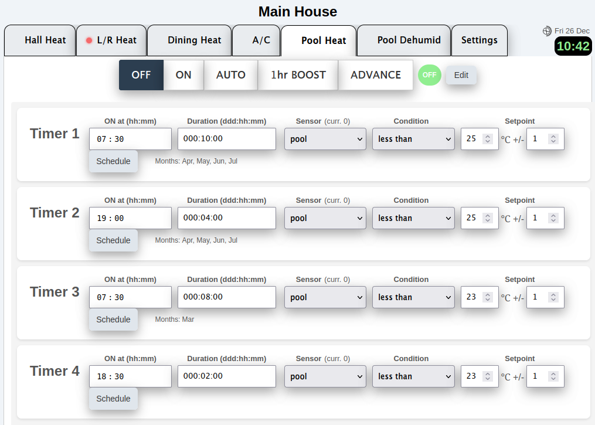
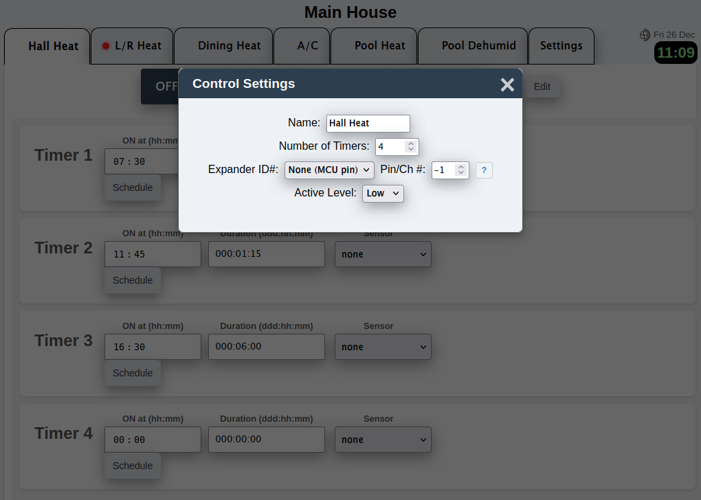
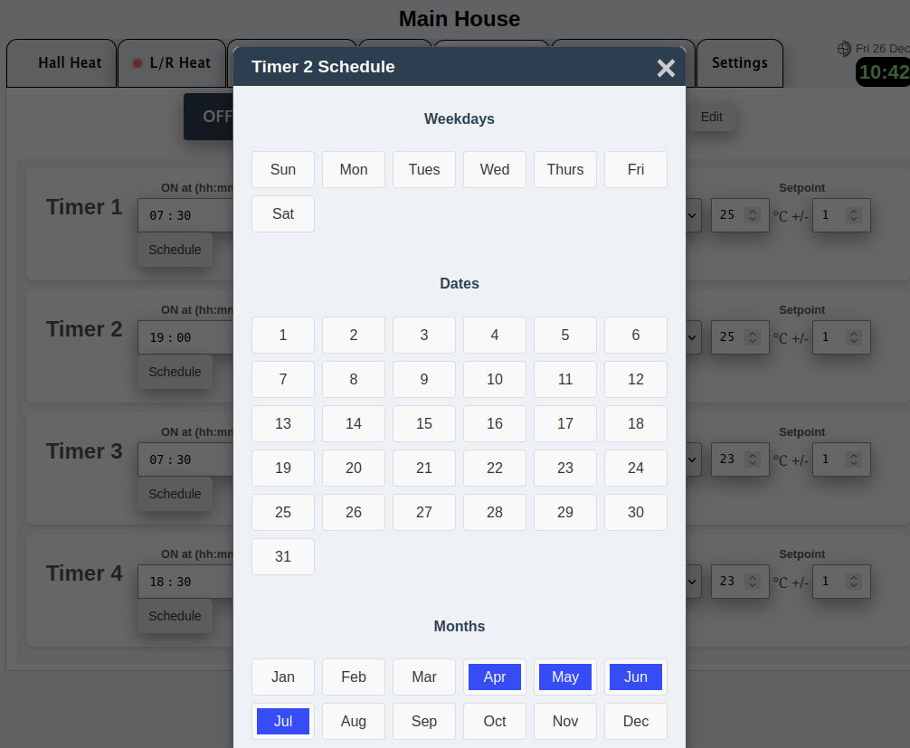
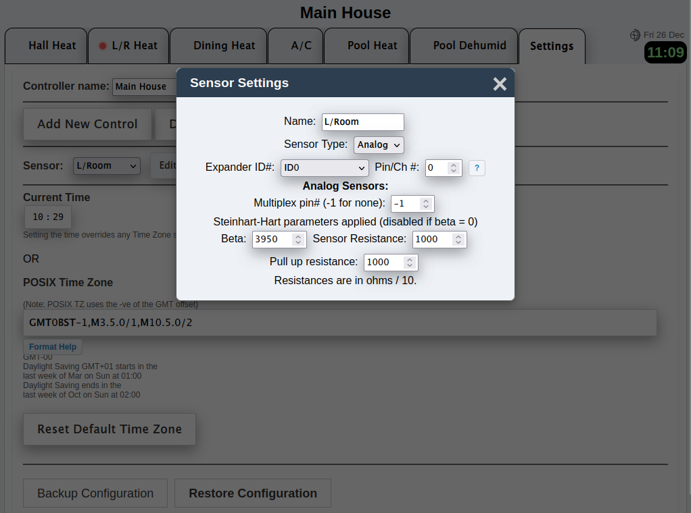

# Multi-Channel Programmable Timer Controller

A comprehensive highly flexible and programmable controller for managing timers, sensors, and outputs, with a web-based user interface for configuration and monitoring based on the Espressif ESP8266 or ESP32.  

It supports 126 control outputs, each with up to 126 timer periods with optional input sensors (126 max.).  Input sensors supported are thermostats, switches, thermistors, etc.

Time is supplied and updated using Internet NTP servers (user-defined time zone) - no realtime clock hardware is required.  

A configuration web page for connection to the local WiFi network. 

An optional low cost OLED display to show WiFi connection QR codes and IP addresses for initial network setup and (once connected to the local WiFi network) the devices IP address on the local network.  

If the local network supports it, the device will be available at the IP address name you set as the `Controller Name` in the settings tab (default is `http://example.LOCAL`).  Name must be domain-name compliant (alphanumeric, '-' or '.' chars).

**CONTROLS**
Each control is 'connected' to an hardware output and can be named and set active low or high.  Output pins can be located on an I2C-connected IO expander (63 max.) or on a ESP GPIO pins.

**TIMERS**
Each timer (up to 126 per control) has, in addition to a programmable time/scedule period, a setpoint value that can use any any available input sensor (thermostat, switch, etc.).  If the current time is within the time/duration/weekday/date/month AND either there is no timer input sensor for that timer OR the sensor input meets the setpoint conditions (hysteresis, lessthan/morethan/within/outwith) the control output will turn on.  For a less/more than setpoint condition, hysteresis can be used to create a 'dead zone' within which the output won't change state (eg if the set point is 25 and hysteres is +/-2 then the timer won't change state when the sensor is between 23 and 27 inc.).  For within/outwith conditions the output is enabled when the sensor value is either inside the range defined by setpoint +/- hysteresis OR, for outwith, outside of that range (either higher or lower).

**INPUT SENSORS**
Sensors can be either simple on/off digital switches or variable voltage (analog).  They can be simultaneously used by multiple timers across all controls.  Max. # of input sensors is 126 and they can be located on I2C IO/ADC expanders or ESP GPIO pins.

Controls/Timers & Sensors are all programmed by the user through the web interface. Users can also backup (download) and restore the complete current configuration of the device (NOT including the WiFi configuration).

### Control Operating Modes

**ON** Sets the control active regardless of timer period settings.  The behaviour of this option can be changed using the `USE_ANY_TIMER_STAT` and `USE_TIMER1_STAT` compile time options in `main.h` (see file for documentation).

**OFF** Disables (set the control output inactive) the control regardless of timers or sensors.

**AUTO** If the current time is within the time/duration/weekday/date/month OR, either there is no timer input sensor for that timer OR the sensor input meets the ON conditions, then the control will turn on.

**BOOST/ADVANCE** modes use a 'hidden' timer.  Its ON time is set to the current time.  *ADVANCE* uses the OFF time from timer1 and *BOOST* sets the OFF time to the current time plus 1 hour.  Advance essentially 'brings forward' the ON time for timer1.   If the current time is already past the timer1 ON time OR timer1 has no on/off time set then advance will have no effect.  If timer1 has an active input sensor then it can also used by boost/advance to control the output (complie time option).  When the advance/boost time period ends the control will revert to its previous mode (ON/OFF/AUTO).  Selecting BOOST when it is already active will reset the OFF time to the current time plus one hour again..

## WiFi Configuration

In addition to flashing the code to a new device you must also upload the filesystem image.  The SPIFFS system files can be found in the `project/data` directory.  Upload the filesystem image to the device using PlatformIO - `PlatforionIcon->expand 'Platform' item->Build Filesystem` then `Upload Filesystem`.

On first startup the device will make available an access point (**Timer_Controller**) to which you can connect to configure access to your local WiFi network (Config Page IP address is **http://10.1.1.1**).  The onboard LED will flash at around 1Hz to indicate the device is in access point/config mode.  Once configured and restarted the LED flashes fast whilst conecting to your WiFi network then, once connected it turns off.

## General Control/Timer/Sensor Configuration

### Controls
Controls are added using the Settings tab page `'Add Control` button.  Each control has an edit button which can be used to change the hardware options.  Outputs can be located on a I2C connected MCP23017 IO expander (four are supported) or an ESP GPIO pins.

### Input Sensors
Input sensors are also added on the Settings page and can also be edited there.  They can be connected via an I2C expander module (ADC1115 or MCP23017) instead of a GPIO pin by selected the expnader ID# (0 is the first expander I2C address - I2C address 0x48 for the ADC1115, 0x20 for the MCP23017).  The analog input ADC1115 has four ADC channels per device, the MCP23017 has 16 digitial input - you can add up to 4 of each expander making a total of 16 ADC inputs and 64 digital IO in addition to any available ESP GPIO pins.

Analog thermistor/variable voltage type inputs can have the Steinhart-Hart equation applied (using beta, resistance and 3.3V pull up resistance parameters).  The reference voltage is selected automatically depending on the device (ESP8266 = 1V ESP8266 D1 Mini 3.2V, ESP32 = 1.1V and ADC1115 is 6.144v).  Each ESP GPIO ADC input can be multiplexed between multiple sensors by defining a grounding pin in the sensor definition (a sensor is grounded to read it - the ADC is connected in common to all the other pins of all multiplexed sensors) - useful for the ESP8266 which only has one ADC.

### Timers
In addition to normal on/duration period settings you can also select which week days/date/months the tiemr will be active on.  If you don't select any weekday/dates/months then the timer will be active on ALL days/weekdays/months.  If options are selected for the weekday/date/month then they are all used to detemine whether the timer is activated.  This allows, for example, the timer to be active on the first Tuesday of August (select Tuesday as the weekday, dates 1-7 and August as the month).

If a sensor is defined for a timer the operation of the lessthan/morethan setpoint options on each timer is clear for analog/thermistor type inputs.  For digital/switch inputs `LESSTHAN` will invert the the sensor active state (i.e. if lessthan the sensor will be active when the input is read as **inactive** - inverting the condition).  This allows the use of the same sensor on different timers/controls with one turning on when the sensor is active and another output turing on when it is inactive.  

For analog sensors you can add a hysteresis value creating a 'dead zone' within which the output won't change state (it will maintain its current state until it reaches one boundary of the zone).  The hysteresis value can also be used to define a range using the within/outwith options.  The output won't turn on unless the sensor value is outside/inside the range defined by setpoint minus hysteresis to setpoint plus hysteresis.

## General
The device automatically restarts every 24 hours to avoid potential long-term heap fragmentation issues (although none have been detected it is common with long running embedded systems).  A restart will only occur if no controls are currently active.  It will save the current time if shutdown.  If it is unable to access an NTP server at power up it will use the saved time instead and keep time using the internal device oscillator (less accurate than an NTP server but, until it drifts by more than one minute, it is unlikely to be an issue for most appllications) until an NTP connection is re-established.

If you enter the wrong WiFi password or network during configuration the device will be unable to connect to the network.  The board LED will flash rapidly as it tries to connect.  If it fails to connect after a few seconds it will enter Access Point Configuration mode for another 5 minutes before restarting (the LED will slowly flash).  You can then connect to the device AP and access the WiFi config page at **http://10.1.1.1**

Settings also tab allows backup and restores of the full configuration (n/inc. WiFi settings) to file **config_backup.dat**.

## Hardware
Almost any variant of the ESP8266 OR ESP32 is suitable for this project - the main criteria is usually the number of GPIO pins available on the board.  If using expanders (up to 4 of each ADC1115 or MCP23017), each must have a unique I2C address (starting at 0x48 for ADC1115, and 0x20 for MCP23017 - see datasheets) AND must be 3.3V powered to be compatible with the 3.3V ESP device inputs.  If using an OLED display then I've found the 1.3" versions display a better quality QRcode (the 0.96" display work but some cameras have issues reading the QR code).

### Web Interface
The HTML for the currently displayed control and its timers is is constructed by Javascript from data loaded  when the user selects that control to view.  This considerably reduces the size of served html (there is limited serving capacity on ESP8266/32) and allows the number of controls to be increased up to 126 without any noticeable performance hit (other than a small increase in RAM usage and a slight delay when changing controls).

>   The web interface is designed to be used on a local network.  It is not secure and should not be exposed to the internet.  It is only intended to be used to configure and monitor a locally installed controller.

## Credits
Includes code from Matthew Ford,  2021/12/06 (c)2021-2022 Forward Computing and Control Pty. Ltd. https://www.forward.com.au/pfod/HomeAutomation/PowerTimer/index.html NSW, Australia  www.forward.com.au  This code may be freely used for both private and commerical use. Provide this copyright is maintained.
